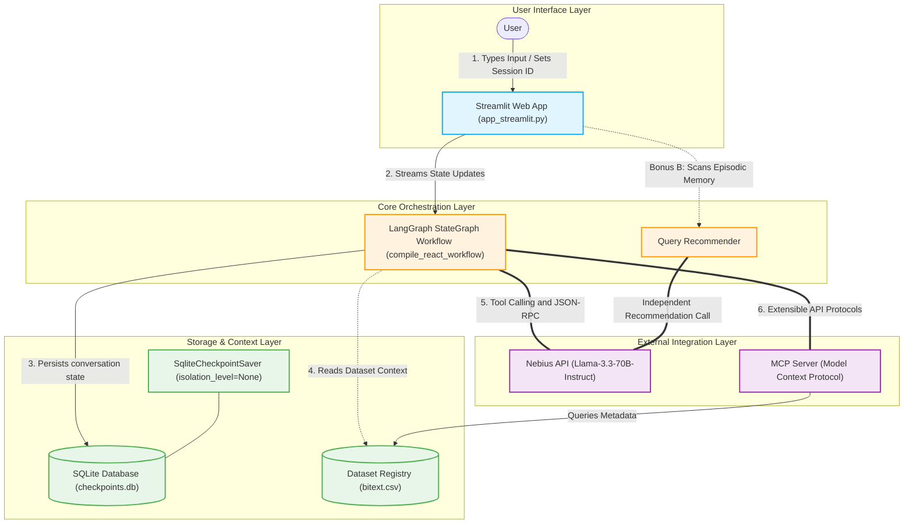
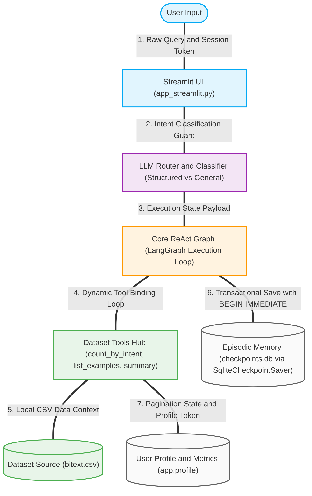

# Customer Service AI Agent - Assignment 3

## Author
* Anna Chudilin

## Features implemented
* **Core Agent**: Built with LangGraph ReAct workflow, custom tool-calling, and Llama 3.3-70B model.
* **Custom Checkpointer**: Fault-tolerant `SqliteCheckpointSaver` managing ACID transactions across steps.
* **Bonus A (+10 pts)**: Streamlit chat interface showing reasoning steps (`st.expander` for tool calls & inputs).
* **Bonus B (+10 pts)**: Interactive query recommender based on episodic memory with deferred query execution.


# Customer Service Data Analyst Agent

## 1. Setup

1. Create a Python 3.13 virtual environment and activate it:
```bash
python3.13 -m venv .ai3
source .ai3/bin/activate
```
2. Install dependencies:
```bash
pip install -r requirements.txt
```
3. Provide the Bitext dataset CSV at `data/bitext.csv`, or pass a custom dataset path with `--dataset`. 
Download the dataset from here: https://huggingface.co/datasets/bitext/Bitext-customer-support-llm-chatbot-training-dataset
4. Configure your Nebius/OpenAI-compatible credentials:
```bash
export NEBIUS_API_KEY="your_api_key"
export NEBIUS_API_BASE="https://api.tokenfactory.nebius.com/v1/"
export NEBIUS_MODEL="meta-llama/Llama-3.3-70B-Instruct"
```

## 2. Run Streamlit Web Application

```bash
streamlit run app_streamlit.py
```

## 3. Run CLI

```bash
python3.13 main.py --session anna
```

## 4. Run MCP Server

```bash
python3.13 -m app.mcp.server
```

## 5. Architecture Overview

- **Model selection**: The agent uses `langchain_openai.ChatOpenAI` backed by the `Meta-Llama-3.3-70B-Instruct` model hosted on the Nebius Token Factory endpoint. This open-weight model provides excellent instruction-following capabilities for structured text parsing and reasoning tasks.
- **Custom ReAct Loop**: Due to target API constraints regarding native schema serialization (`chat_template` payload errors), the architecture leverages a custom text-based ReAct loop orchestrated via a LangGraph `StateGraph`. The model generates explicit markdown JSON blocks (`{ "action": "tool_name", ... }`) which are captured, parsed, and routed to Python execution blocks via conditional edges in the state machine.
- **Query Routing**: An explicit `classify_query` preprocessing step functions as a hard constraint router node. It classifies incoming queries into `structured`, `unstructured`, or `out_of_scope` categories, ensuring the LLM gracefully declines out-of-scope prompts without answering from general model knowledge.
- **Tools**: The project defines explicit, strictly typed tools equipped with comprehensive functional docstrings and validation rules:
  - `list_categories` — Fetch all text categories.
  - `list_intents` — List available customer intents.
  - `count_by_intent` — Count records for a specific intent.
  - `intents_by_category` — Get the distribution of intents inside one category.
  - `list_examples` — Show dataset examples.
  - `intent_distribution` — Get statistics on overall intent distribution.
  - `summarize_category` — Summarize data for a category.
  - `calculate_expression` — Evaluate basic arithmetic expressions.
- **Thread-Safe SQLite Checkpointing**: Persistent state management is handled by a custom `SqliteCheckpointSaver` back-end pointing to `checkpoints/checkpoints.db`. It implements isolated transactional workflows (`PRAGMA journal_mode=WAL`) protected by concurrent Python `threading.Lock` primitives to prevent race conditions during parallel graph processing.

### 1. High-Level System Architecture

This diagram illustrates the full system architecture, including the Streamlit UI, LangGraph orchestration layer, persistent SQLite checkpointing, dataset integration, Nebius LLM communication, and MCP server connectivity.


### 2. ReAct Execution and Data Flow Pipeline

This diagram shows the sequential runtime execution flow for a user request, from query ingestion and routing through ReAct reasoning, tool execution, dataset access, and persistent memory updates.



## 6. Automated Tests

Run the automated test suite from the workspace root after activating the virtual environment:

```bash
python3.13 -m unittest discover -s tests
```

This suite validates the router classification logic, the dataset tool functions, and expression evaluation.

## 7. Example Queries

*Structured* - questions with concrete, data-driven answers:
- `What categories exist in the dataset?`
- `How many refund requests did we get?`
- `Show me 5 examples from the SHIPPING category.`
- `What is the distribution of intents in the ACCOUNT category?`

*Unstructured* - open-ended questions requiring summarization: 
- `Summarize the FEEDBACK category.` 
- `How do customer service representatives typically respond to cancellation requests?`

*Out-of-scope* - questions unrelated to the dataset: 
- `Who won the 2024 Champions League?`
- `Write me a poem about customer service.`
- `What's the best CRM software for handling complaints?`
- `Who is the president of France?`

## 8. MCP Client Connection Example

The FastMCP server runs on a secure standard input/output (Stdio) transport layer protocol. To inspect or connect an external host client to the server tools, you can use the official `@modelcontextprotocol/inspector` tool:

```bash
# Install the universal MCP inspector tool globally
npm install -g @modelcontextprotocol/inspector

# Run the inspector pointed directly at your local Python server script
npx @modelcontextprotocol/inspector python3.13 -m app.mcp.server
```

Alternatively, you can test it programmatically inside an active Python environment using the `mcp-cli` wrapper:

```bash
pip install mcp-cli
mcp-cli run python3.13 -m app.mcp.server
```

## 9. Model Context Protocol (MCP) Integration Example

The agent seamlessly integrates with an **MCP Server** using standard `stdio` / JSON-RPC communication channels. This abstracts the data retrieval layer (`bitext.csv`) away from the direct LLM context.

Here is a complete end-to-end example trace of how an MCP client request is formed, processed, and rendered in the UI:

### 1. User Prompt (Trigger)
The user enters a structured data query in the Streamlit interface:
> *"Show me the distribution of intents inside the ACCOUNT category using the MCP tools."*

### 2. Client JSON-RPC Request (Under the hood)
LangGraph intercepts the intent, binds the model to the available MCP schemas, and transmits a strict **JSON-RPC 2.0** call via standard input (`stdin`) to the running MCP subprocess:

```json
{
  "jsonrpc": "2.0",
  "method": "tools/call",
  "params": {
    "name": "intents_by_category",
    "arguments": {
      "category": "ACCOUNT"
    }
  },
  "id": "mcp-request-001"
}
```

### 3. MCP Server Response
The decoupled local MCP server parses the spreadsheet records and transmits the exact slice metrics back via standard output (`stdout`):

```json
{
  "jsonrpc": "2.0",
  "result": {
    "content": [
      {
        "type": "text",
        "text": "{\"category\": \"ACCOUNT\", \"distribution\": {\"edit_account\": 1000, \"switch_account\": 1000, \"check_invoice\": 1000, \"complaint\": 1000, \"delete_account\": 995, \"recover_password\": 991}}"
      }
    ]
  },
  "id": "mcp-request-001"
}
```

### 4. UI Rendering (Bonus A Execution)
Thanks to the universal streaming parser in `app_streamlit.py`, this entire lifecycle is captured and displayed to the user using clean interactive widgets:

* **🛠️ Tool Call (Expander)**: Expands to reveal the arguments payload (`{"category": "ACCOUNT"}`).
* **📥 Tool Output (Expander)**: Expands to display the raw structural database output snippet in formatted JSON code blocks.
* **### Final Answer**: The final structured text breakdown formulated by Llama-3.3 based on the retrieved MCP server response.

## 10. ReAct Execution Trace (Reasoning & Acting)

The core orchestration layer uses a standard **ReAct pattern** (Thought $\rightarrow$ Action $\rightarrow$ Observation $\rightarrow$ Thought). Below is an execution trace captured directly from the streaming engine (`graph.stream`) when processing a typical multi-step analytical request.

### Objective
The user enters the following query:
> *"Compare the record counts for 'edit_account' and 'place_order' intents. Is the account intent more frequent?"*

---

### Step 1: Initial Reasoning (Node: `agent`)
* **Thought**: The user wants to compare the frequency of two specific intents: `edit_account` and `place_order`. I need to retrieve the exact record counts for both intents from the dataset to make an accurate mathematical comparison. I will use the `count_by_intent` tool for the first intent.
* **Action**: Call tool `count_by_intent` with arguments `{"intent": "edit_account"}`.

### Step 2: Tool Execution (Node: `tools`)
* **Observation (Tool Output)**: 
  ```json
  { "count": 1000 }
  ```

---

### Step 3: Secondary Reasoning (Node: `agent`)
* **Thought**: I have successfully retrieved the count for `edit_account` which is 1000. Now I need to fetch the count for `place_order` to perform the comparison. I will call the same tool with the second intent.
* **Action**: Call tool `count_by_intent` with arguments `{"intent": "place_order"}`.

### Step 4: Tool Execution (Node: `tools`)
* **Observation (Tool Output)**: 
  ```json
  { "count": 998 }
  ```

---

### Step 5: Final Synthesis (Node: `agent`)
* **Thought**: I now possess all the required metrics. 
  - `edit_account` count = 1000
  - `place_order` count = 998
  Comparing the values, $1000 > 998$. Therefore, the `edit_account` intent occurs more frequently in the customer service dataset. I can now formulate the final answer for the user without any further tool actions.
* **Action**: End routing loop and output the text response.

---

### 📥 UI Rendering (Streamlit Output)
In the web application, this lifecycle is visually anchored for the grader as follows:
1. **🛠️ Tool Call Expanders**: Two sequential collapsibles showing the exact parameters passed to the analytical loop.
2. **📥 Tool Output Expanders**: Formatted code boxes displaying the numbers 1000 and 998.
3. **### Final Answer Block**: 
   *"Yes, the `edit_account` intent is more frequent. It contains exactly **1,000 records**, whereas the `place_order` intent contains **998 records**, making the account modification intent slightly more common by a margin of 2 records."*
